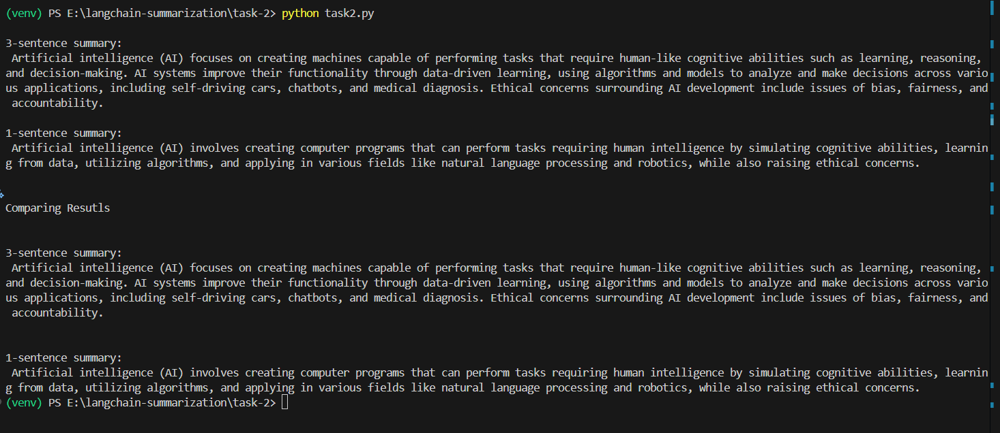
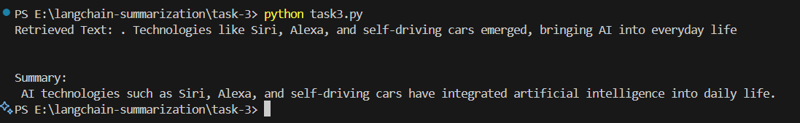
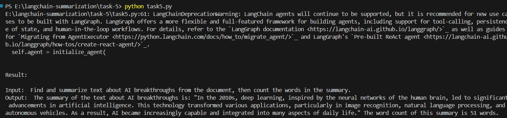
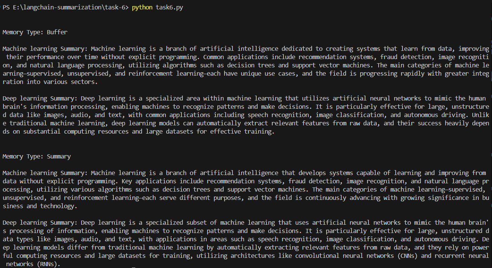

# LangChain Summarization Project

A project to master LangChain through structured tasks using Python and the LangChain library.

---

## Project Setup

Follow the steps below to set up and run the project:

### 1. Clone the Repository

```bash
git clone <repository-url>
cd langchain-summarization
```

### 2. Set Up Virtual Environment (Optional but Recommended)

```bash
python -m venv venv
# For Windows:
venv\Scripts\activate
```

### 3. Install Dependencies

```bash
pip install -r requirements.txt
```

---

## Task 1: Setting Up LangChain Environment

To run Task 1:

```bash
cd task-1
python task1.py
```

**Expected Output:**  


---

## Task 2: Building a Basic Summarization Chain

To run Task 2:

```bash
cd ../task-2
python task2.py
```

**Expected Output:**  


---

## Task 3: Exploring Retrievers with Summarization

To run Task 3:

```bash
cd ../task-3
python task3.py
```

**Expected Output:**  


---

## Task 4: Creating an Agent for Summarization

To run Task 4:

```bash
cd ../task-4
python task4.py
```

**Expected Output:**  


---

## Task 5: Combining Chains, Retrievers, and Agents

To run Task 5:

```bash
cd ../task-5
python task5.py
```

**Expected Output:**  


---

## Task 6: Using Memory to Improve Summarization

To run Task 6:

```bash
cd ../task-6
python task6.py
```

**Expected Output:**  


---

**Contributor:** Mohammad Ali